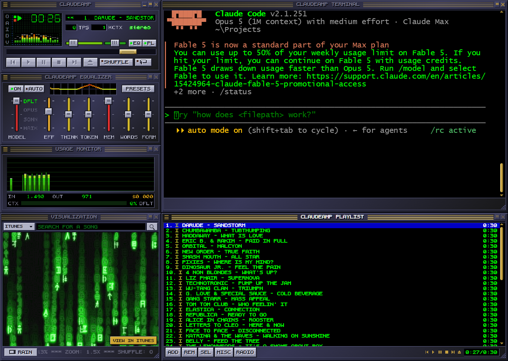

<div align="center">
  <p></p>

  <p>
    <strong>A classically-styled terminal interface for Claude Code, OpenAI Codex, and Ollama.</strong>
  </p>

  <p>
    <a href="https://github.com/petehottelet/claudeamp/releases/latest"></a>
    <a href="https://github.com/petehottelet/claudeamp/actions/workflows/verify.yml"></a>
    
    <a href="LICENSE"></a>
  </p>

  <p>
    <a href="https://www.claudeamp.com/download"><strong>Download for Windows, macOS, and Linux</strong></a>
    ·
    <a href="https://github.com/petehottelet/claudeamp/releases/latest">Release notes</a>
  </p>
</div>



**ClaudeAmp is a classically-styled terminal interface** for Claude Code,
OpenAI Codex, and Ollama on Windows, macOS, and Linux. Six draggable, snapping,
windowshade-able windows live on a transparent standalone desktop surface: a main deck whose transport
plays a built-in catalog of official 30-second iTunes previews, local digital
music, direct audio streams, YouTube embeds, and Spotify Connect, an
equalizer whose sliders genuinely
tune the model — which provider you talk to, how hard it thinks, what
personality it plays in — a green-phosphor chat terminal, a playlist, a
minibrowser, and a usage monitor drawn like a spectrum analyzer.

Every pixel is hand-drawn CSS/canvas in the classic style — stepped
pixel-art glyphs, hard-band bevels, our own AmpDot bitmap font on every
surface, a bitmap ticker and 7-segment LCD. The browser client uses no
framework or bundler and contains no original Winamp assets.

## Standalone desktop app

ClaudeAmp ships as a frameless Electron app: there is no browser toolbar,
address bar, menu bar, or decorative faux desktop behind the player. The
transparent area around its snapped windows shows the real Windows desktop.

```bash
npm install
npm start             # run the standalone development build
npm run dist          # build installers for the current platform
```

The installed app starts its loopback-only CLI/search bridge automatically.
The first launch opens at crisp 1.5× scale and shows a full-window welcome
screen: pick your model provider and access method (subscription CLI, API
key, or local Ollama), paste a key if that path needs one, then choose
whether the main window is the AI chat or a **real terminal** that
auto-runs the CLI for the provider you picked (Claude Code, Codex, or
`ollama run`). Everything the welcome screen sets stays editable in
**Settings** (main-window hamburger menu), including the desktop zoom.
Use **Options** to choose read-only or workspace access and the folder Claude
Code/Codex may work in. Read-only is the default and really is read-only
(the CLI gets no edit, write, or shell tools). Workspace mode allows edits
in your chosen folder; running **shell commands** is a further opt-in
checkbox, off by default, because an auto-approved shell is not confined to
the workspace folder (Codex needs no switch — its sandbox is OS-enforced).

To connect a subscription CLI, choose **Options → Claude Login...** or
**Codex Login...**. ClaudeAmp opens a real, visible authentication terminal and
starts `claude auth login` or `codex login` for you. Complete its browser/device
prompt; ClaudeAmp detects the completed login and activates that CLI
automatically (**Refresh Models** is available if you want to check immediately).
Typing `/login` uses the currently selected subscription CLI; explicit
`/claude-login` and `/codex-login` shortcuts are also available. Other chat text
is never executed as a shell command.

## Browser development mode

```bash
node bridge.js            # serves http://localhost:8014/ + CLI/search bridge
# or, static only (no subscription CLIs):
python3 -m http.server 8080
```

## Native app (Windows / macOS / Linux)

Run it like the real thing — no browser chrome, no teal backdrop, the skin
windows float straight over your desktop and empty space clicks through to
whatever's behind:

```bash
npm install               # pulls Electron (dev dependency only)
npm start                 # frameless transparent shell over your desktop
npm run dist:win          # Windows NSIS installer
npm run dist:mac          # macOS .dmg + .zip (arm64 and x64)
npm run dist:linux        # Linux AppImage
```

On Linux, download the AppImage from the [Releases page](https://github.com/petehottelet/claudeamp/releases/latest), `chmod +x` it, and
run it — click-through window shaping uses the same native region path as
Windows.

The shell starts its own loopback bridge on a stable local port (with a safe
fallback if that port is occupied), so settings and window positions persist
between launches. The main window's ✕
quits the app (the other windows just close), and Ctrl/Cmd+Q works too.

Per-platform mechanics: on Windows/Linux the visible panels become the
native window region via `setShape`, so gaps are genuine desktop. macOS has
no window shaping, so the shell instead hit-tests the cursor against the
same panel rectangles and toggles click-through on the fly — same feel,
different plumbing. The guided CLI login opens PowerShell on Windows and
Terminal.app on macOS.

The desktop app also wraps a genuine terminal in the skin chrome: the
**CLAUDEAMP SHELL** window hosts a real PTY (PowerShell on Windows, your
login shell on macOS) rendered by xterm.js in classic green-on-black, so you
can run anything there — including `claude` itself. Toggle **Terminal** in
the menu (`Ctrl`/`Cmd+7`, or pick Real Terminal on the welcome screen) and the
shell replaces the chat window outright, auto-launching the CLI for your
selected provider.

Tagged releases (`git tag v1.7.2 && git push origin v1.7.2`) build the installers
automatically via GitHub Actions and attach them to the GitHub release, so
users pick `ClaudeAmp-Setup-<version>.exe` or `ClaudeAmp-<version>-<arch>.dmg`
from the same [Releases page](https://github.com/petehottelet/claudeamp/releases/latest).

**Easiest macOS install** — one line in Terminal, no Gatekeeper dialogs:

```bash
curl -fsSL https://claudeamp.com/install | sh
```

It downloads the right build for your Mac (Apple Silicon or Intel),
verifies it against the release's `SHA256SUMS.txt` (attached by CI from
v1.6 on — the installer prints `Checksum verified.`), installs to
/Applications, clears the quarantine flag, and launches.

If you install from the .dmg by hand instead: the macOS builds are ad-hoc
signed rather than notarized, so the first launch shows Apple's "could not
verify ClaudeAmp is free of malware" dialog. On macOS 15 Sequoia and
later: click **Done** (not Move to Trash), open **System Settings →
Privacy & Security**, scroll to the Security section where ClaudeAmp is
listed as blocked, click **Open Anyway**, and confirm. One time only.
Terminal alternative: `xattr -cr /Applications/ClaudeAmp.app` — that also
cures any **"is damaged"** claim, which is the same quarantine flag
talking.

Out of the box the transport plays the built-in 90s iTunes-preview playlist. If you try to
chat before connecting a model, ClaudeAmp keeps your message in the input,
opens the menu, and points directly at the appropriate login/setup action. Open local music with the eject
button, `Ctrl+O`, or by dropping files onto the playlist. To connect a model,
pick one
in right-click → **Options…** (or the `O` on the main window's left edge):

| Model provider | Auth | How it connects |
|---|---|---|
| **Claude** | Anthropic API key | Browser → `api.anthropic.com` (streaming, `anthropic-dangerous-direct-browser-access`) |
| **OpenAI** | OpenAI API key | Browser → `api.openai.com/v1/responses` (streaming) |
| **Gemini** | Google AI key | Browser → `generativelanguage.googleapis.com` (streaming) |
| **Claude Code (subscription)** | none — your `claude` CLI login | `bridge.js` spawns `claude -p --output-format stream-json` |
| **Codex CLI (subscription)** | none — your `codex` CLI login | `bridge.js` spawns `codex exec --json` |
| **Ollama Local** | none | loopback bridge → local Ollama `/api/tags` + `/api/chat` |

> In the desktop app, API keys are encrypted at rest with your OS keychain
> (Electron `safeStorage`); running as a plain web page they live in the
> browser's localStorage. Either way, use personal keys you can revoke, and
> don't host this publicly with shared keys. The subscription CLIs never
> see a key at all: `bridge.js` binds to `127.0.0.1`, rejects cross-origin
> calls, and simply relays prompts to the CLI you already logged into. Your
> credentials stay inside the CLI.

For a local model, install Ollama, start its local service, and pull at least
one model (for example, `ollama pull llama3.2`). Choose **Ollama Local** in
Options, press **Refresh Models**, then use the EQ MODEL slider to select among
the models returned by the local service. No ClaudeAmp API key is required.

## The music

ClaudeAmp plays local MP3, WAV, OGG, Opus, AAC/M4A, browser-supported FLAC,
and direct HTTP audio streams. Files are stored in the browser's private
IndexedDB library so they remain playable after a reload; nothing is uploaded.
Add individual files, select a folder, or drag files onto the playlist. You can
multi-select and remove tracks, drag to reorder, jump by title, sort or
randomize, and create named saved playlists. Import and export M3U/M3U8, PLS,
or ClaudeAmp JSON playlists. When an imported playlist references files you did
not select, ClaudeAmp keeps a relinkable placeholder instead of silently
dropping the entry.

The Visualization search bar can search iTunes previews, YouTube, or a connected
Spotify account. Results that do not expose a playable preview, stream, or embed
are filtered out before they reach the list. One click adds a result; a
double-click adds and plays it. The visualization menu switches among filtered
video, HD video, and pixel effects; Rain is the first-run default.

The default playlist ships with 50 official 30-second iTunes previews spanning
90s alt-rock, hip-hop, punk, and dance: Darude — Sandstorm, Chumbawamba,
Haddaway, Eric B. & Rakim, Wu-Tang Clan, G. Love & Special Sauce,
Semisonic, Pixies, the Breeders, Belly, the Lemonheads, Elastica, Republica,
Spacehog, Letters to Cleo, Faith No More, Candlebox, Alice in Chains,
Dinosaur Jr., Orbital, Mustard Plug, New Order, Depeche Mode, Technotronic,
Rush, Ben Folds Five, Smash Mouth, and 4 Non Blondes. Previews are streamed
directly, never downloaded or cached, and the player shows iTunes attribution
plus a store link. YouTube results are tested in a hidden player so blocked
embeds never appear in search results. ⏏ (or ADD) also accepts a YouTube URL.

| Control | Does |
|---|---|
| ⏮ ▶ ⏸ ⏹ ⏭ | The real thing: previous / play / pause / stop / next track |
| ⏏ | Open local audio files |
| **ADD** | Add files, a folder, a URL/stream, or a playlist file |
| **REM / SEL / MISC** | Remove/crop, select/jump, save/load/sort/export playlists |
| **SHUFFLE / REP** | Shuffle playlist / repeat track |
| Volume slider | Actual player volume |
| Seek bar | Scrubs the current track |
| LCD timer | Track time (blinks on pause); click for total-token mode |
| Ticker | `1. DARUDE - SANDSTORM (3:44)` — you know the one |

## The chat

Type in the chat window, **ENTER** sends, **STOP**/**ESC** halts a reply
mid-stream (the partial answer is kept), **CONV** switches, creates,
regenerates, or deletes conversations. While a reply streams, the spectrum
analyzer dances, `TPS` shows live tokens/second, and the seek bar tracks
output against the TOK cap.

### Equalizer — the model tuner

The left slider is the **preamp = MODEL** within the selected provider (its
four tick labels change per provider). The eight bands:

| Band | Maps to |
|---|---|
| `EFFORT` | Claude: `output_config.effort` (low→max) · OpenAI: `reasoning.effort` |
| `THINK` | Claude: thinking off / adaptive / show summaries; Haiku budget tokens |
| `TOKENS` | Max output tokens (512 → 16384) |
| `MEMORY` | How much history is sent per message |
| `WORDS` | Terse ↔ expansive replies — compiled into the system prompt |
| `FORMAL` | Casual ↔ professional tone — compiled into the system prompt |

Every band does something real to the request.

Balance pans the model between analytical (left) and creative (right).
**ON** toggles whether the EQ shapes requests; **AUTO** resets flat;
**PRESETS** has the good stuff: *Speed Demon*, *Galaxy Model*, *Corporate
Rock*, *3AM Poetry*, *Caffeinated*. Per-model API quirks (Fable 5's
always-on adaptive thinking, Opus 5's effort/thinking rules, Haiku 4.5's
`budget_tokens`) are handled for you.

### Usage monitor

Tokens-per-turn drawn like the visualizer: dim green input bars, classic
red-to-green gradient output bars, blinking peak cap on the live turn.
Below: session totals, estimated cost (public list prices; subscription
turns show $0), and a context-window meter.

## Tips

- The first desktop launch starts with all six windows cleanly docked, with no
  one-pixel seams. Drag any docked window to move its whole connected group;
  hold `Alt` while dragging to pull just one window away.
- Double-click any titlebar to windowshade; right-click for the menu
  (window toggles, models). Zoom 1×–3× lives in Settings → Display and on
  `Ctrl`/`Cmd` `+`, `-`, and `0`; the first launch defaults to 1.5×, every
  scale stays on the pixel grid and nothing is anti-aliased.
- Clutterbar: `O`ptions, `A`bout, `I` LCD mode, `D` cycles 2×/4×/8×, `V` usage monitor.
- Click the visualizer to cycle spectrum → oscilloscope → off.
- Everything (layout, settings, keys, conversations, active and named playlists)
  persists locally. Audio blobs use IndexedDB; other state uses localStorage.
- Classic player keys: `Z` previous, `X` play, `C` pause, `V` stop, `B` next,
  `J` jump, `L` add a URL, `Ctrl+O` open files, and `Delete` remove selections.

## Files

```
index.html      the six windows + Win95 dialogs
electron/main.cjs  exact native window regions + private bridge lifecycle
electron/preload.cjs  minimal window/workspace/shape IPC API
bridge.js       optional local server: static files + claude/codex CLI relay
css/skin.css    hand-drawn chrome: pixel-band bevels, stepped SVG glyphs,
                embedded AmpDot bitmap font
js/font.js      5×6 bitmap pixel font + 7-segment LCD digits (canvas); the
                same glyphs are compiled into the AmpDot TTF
js/windows.js   dragging, snapping, windowshade, z-order, layout persistence
js/media-library.js  IndexedDB audio library, tag reading, playlist import/export
js/player.js    dual local/stream/YouTube playback and playlist state
js/api.js       Claude / OpenAI / Gemini streaming clients + CLI bridge + demo
js/app.js       state, canvas renderers, controls, chat, playlist, menus
```

## Disclaimers

A from-scratch visual homage to a beloved era of desktop software. Not
affiliated with or endorsed by Winamp, Nullsoft, AOL, or the Winamp rights
holders; contains no original Winamp assets, code, or skin files. Not
affiliated with Anthropic, OpenAI, Google, YouTube, Apple, or Spotify. iTunes
song previews are streamed with “Provided courtesy of iTunes” attribution and
links to their store pages; YouTube embeds follow each video's embed permissions.
Model lists
and prices are best-effort snapshots — edit `js/api.js` to taste. Cost
figures are estimates; check your provider console for real numbers.

Fonts: all skin text, including titlebars, renders in **AmpDot**, our own 5×6
bitmap glyphs (`js/font.js`) compiled into an embedded TTF.

## License

MIT — see [LICENSE](LICENSE).
